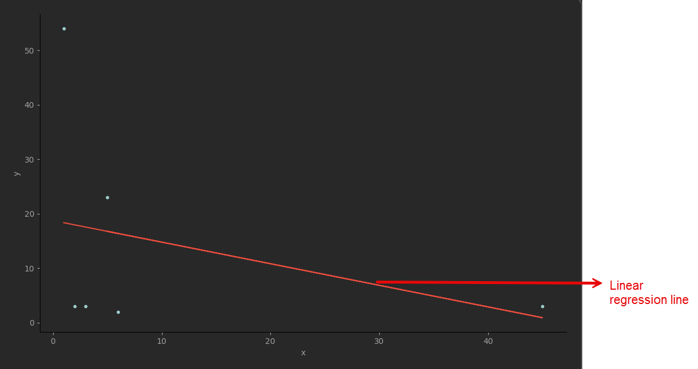
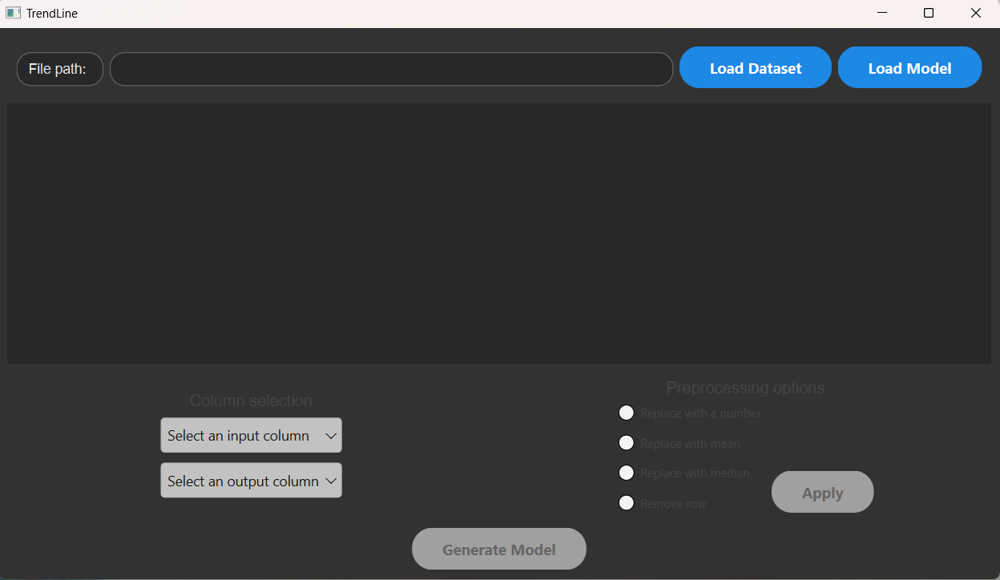
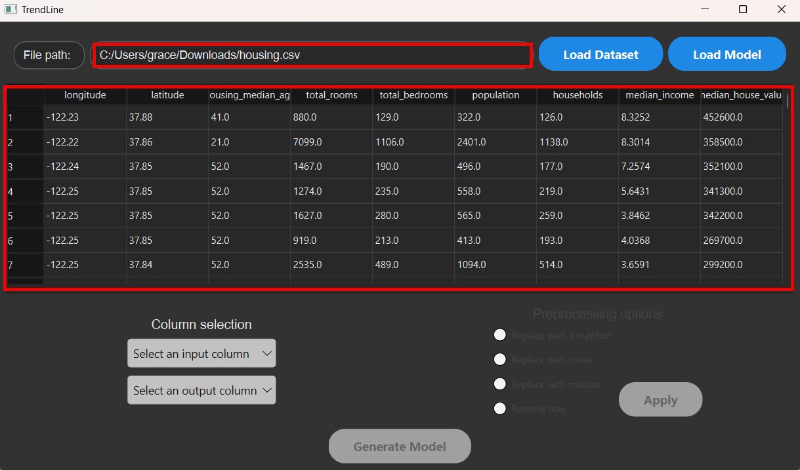
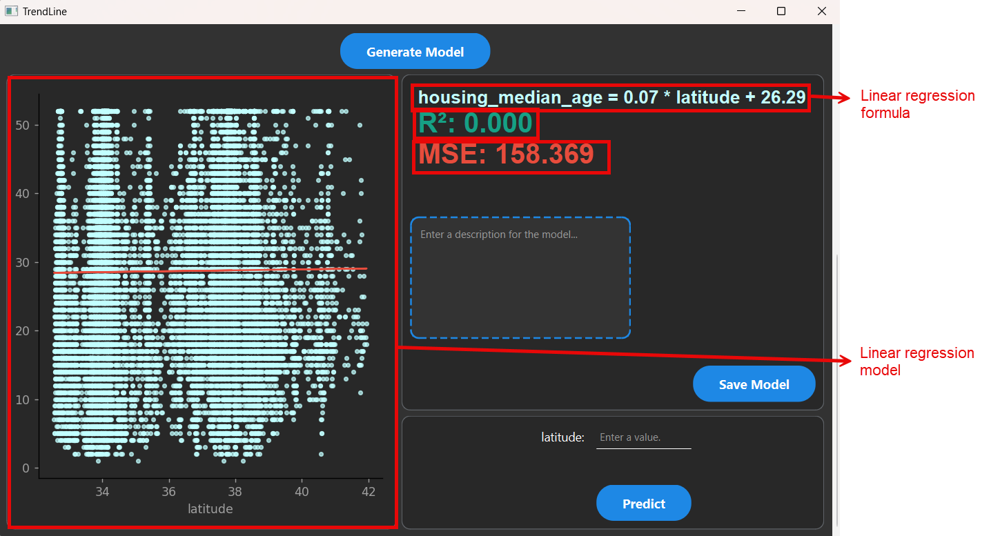
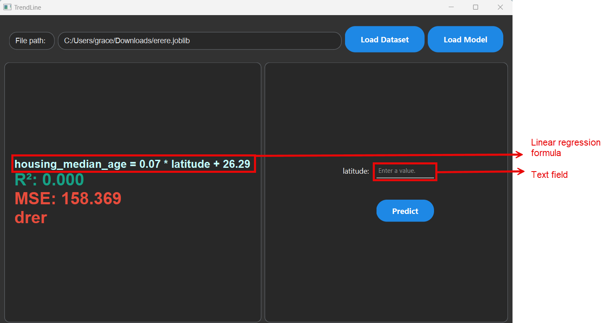

# Introduction

This documentation was created to help you learn:

- why TrendLine was created.
- the applications of TrendLine.
- how to get started with TrendLine.
- the key features of TrendLine.
- how to contact the documentation author for additional information.

# An overview of TrendLine

The purpose of Linear regression is to use one set of data to predict new output data. The predicted data can then be used to plan for future decisions and plans.

You can use TrendLine to upload a dataset, which will then:

- build a graph to show the relationship between the input and output values.
- display the linear regression model’s formula.
- create prediction function to predict new output values.

The functions of the TrendLine are to:

- preprocess the dataset to replace any null values.
- create and save the linear regression’s model, formula and description.
- open the saved linear regression model to use the prediction function.
- enter new input values and receive predicted output values based on the model.

## TrendLine target audience

TrendLine was developed for corporate organizations that rely on using data to drive their decisions and future plans. TrendLine provides a way to analyze datasets and make accurate predictions. It features a user-friendly interface that simplifies complex data and predictive modeling for a wide range of audiences.

## TrendLine system requirements

TrendLine is compatible with both macOS 15 and Windows 11 operating systems. 

# Key concepts in TrendLine

TrendLine incorporates a range of key concepts. To deepen your understanding of the TrendLine’s purpose, explore the following concepts:

- [What is linear regression?](#what-is-linear-regression)
- [What is linear regression used for?](#what-is-linear-regression-used-for)

## What is linear regression?

Linear regression is a model that uses the value of one variable to predict the value of another variable. To create a linear regression model, you need a dataset that includes several pairs of quantitative input and output values. You can then represent the relationship between the input and output values with a straight line called “a linear regression line”.

Figure 1 shows an example of a dataset represented by a linear regression line.

_Figure 1 An example of a linear regression line_

The simplest linear regression formula is represented by the formula y= B1x + B0, where:

- y= the output value
- x= the input value
- B0\= the y-axis intercept
- B1 \= the slope

The linear regression model uses the input value and linear regression formula to predict the corresponding output value.

The linear regression model also produces two important data points:

- the mean square error (MSE)
- the coefficient of determination (R2)

The MSE and R2 evaluate how accurately the linear regression formula represents the dataset, as the predicted output values can vary in accuracy.

A linear regression assumes that the relationship of the input and output values is linear, but this assumption may not always be the most accurate representation. To improve the accuracy of a linear regression model, ensure that the dataset:

- values are accurate.
- does not contain extreme data points (outliers).
- contains sufficient data points.
- represents a wide range of values.

### What is the mean squared error (MSE)?

The mean squared error (MSE) represents the distance between each point to the regression line and squaring it. The distance between each point and the regression line represents the errors, so the MSE is the mean squared error of a set of data. The smaller the MSE, the lower the error.

### What is the coefficient of determination (R2)?

The predictions made by the linear regression are not 100% accurate. To determine the accuracy, the coefficient of determination value must be considered. The coefficient of determination is a number from 0 to 1 that shows the variance that the dependent variable can be explained by the input value. For example, an R2 of 0.2 indicates that there is a 20% of the variance of the predicted output that is explained by the input value. The larger the R2, the more accurate the linear regression represents the dataset.

Table 1 shows how to use MSE and R2 to analyze the linear regression model accuracy. If the model is less accurate, the predictions will also be less accurate. If a linear regression model produces a large MSE and small R2, the user must conduct more analysis to determine if the predictions are reliable. 

| If  | Then |
| --- | --- |
| MSE is small | The model is more accurate. |
| MSE is large | The model is less accurate. |
| R2 is small | The model is less accurate. |
| R2 is large | The model is more accurate. |

_Table 1 Model accuracy based on MSE and R2_

**Use case**
1.	Tonia uploads a dataset with two quantitative variables (age and number of divorces) into TrendLine. 
2.	TrendLine produces a formula with the values MSE= 6 and R2= 0.1. 
3.	Because the model produced a large MSE and small R2, the formula and model are not considered accurate.
4.	Tonia must conduct further analysis to determine if model generates predictions that are reliable. 

## What is linear regression used for?

Linear regressions provide a way to generate predictions that can be used in various subjects, such as biology, business, environmental sciences, and more. It is a well-trusted statistical model that can creates predictions to support business and organizational decisions.

Once the linear regression formula is produced, you can give it a new input value, and the model will calculate the predicted output value.

### Real life applications of linear regressions

Linear regressions can be used when a dataset is available to predict another dataset. For example, linear regression can be used to predict:

- Home sale prices based on number of bedrooms and bathrooms.
- Forecasted precipitation based on weather data.
- Plant growth based on amount of water.

# Getting started with TrendLine

In this section, you will learn how to install TrendLine, create your input dataset and get familiar with the user interface.

## Installing TrendLine

To run TrendLine, you must install it on your computer. 

**To install TrendLine**

1. Go to [TrendLine](#www.trendline.com).
2. Click **Download**.  
   The .exe file will be downloaded onto your computer.
3. Open the .exe file.  
   The installer will open.
4. Follow the prompts to complete the installation.  
   A checkmark will appear when the installation is complete.
   You are now ready to use **TrendLine**.

## Creating the input dataset

To create your model, you must have at least two quantitative sets of data. The input dataset must be organized into columns in a spreadsheet editor such as Microsoft Excel.

All input dataset files must be saved in one of the following formats:

- .csv
- .xlsx
- .xls
- .sqlite
- .db

**Note:** If you upload a file that is not in an accepted format, an error message will appear and prevent you from proceeding.

**To convert an Excel into a .csv**

1. Open **Excel**.
2. Click **File** > **Save as**.  
    A window appears with the file name text box and file format.
1. Click the **File type drop-down** and select _.csv_.
2. Click **Save**.  
    The dataset is saved as a .csv and is ready to be used in the TrendLine.

## Overview of the user interface

TrendLine’s user interface contains various buttons and functions. Getting familiar with the layout and key elements will help you navigate the interface more efficiently. 

**Note:** To ensure you follow the steps in the correct order, the text will become visible in sequence. The Column selection text will become visible after you load the dataset. The Preprocessing text will become visible after you select the input and output columns.

Figure 2 shows the user interface. 

_Figure 2 The user interface_

Table 2 shows the definition for each button on the user interface.

| Button | Function |
| --- | --- |
| Load Dataset | Open your dataset file. |
| Load Model | Open previously saved models. |
| Select an input column | Select your dataset’s independent variable. |
| Select an output column | Select your dataset’s dependent variable. |
| Replace with a number | If the dataset is missing value(s), you can replace the cell with a custom number. |
| Replace with mean | If the dataset is missing value(s), you can replace the cell with the mean. |
| Replace with median | If the dataset is missing value(s), you can replace the cell with the median. |
| Remove row | If the dataset is missing value(s), you omit the row. |

_Table 2 The buttons on the user interface._

# Creating your first TrendLine model

In this section, you will learn how to:

- preprocess a dataset.
- create a linear regression model.
- save a linear regression model.
- open a linear regression model.
- generate predictions using a linear regression model.

## Preprocessing a dataset

Before creating a linear regression model, it is important to preprocess the dataset. If a dataset has missing (null) data in the cells, you may lose significant information that is needed to create an accurate linear regression analysis. Preprocessing the dataset removes the null values, preserves valuable data and ensures more accurate results.

**Note:** If you do not preprocess the data before creating the linear regression model, an error dialog with the message “Data contains NaN values: please, apply preprocessing before generating model”.

**To preprocess a dataset**

1. Click **Load Dataset**.  
    The File Explorer opens.
2. Select your desired dataset and click **Open**.  
    Figure 3 shows the dataset appears as a table and the file path is displayed.
   
_Figure 3 Dataset displaying the table and file path_
    
    **Note:** The dataset cannot be edited from TrendLine. If you need to edit the dataset, you must do it from your original spreadsheet.

3. Select the _input column_.  
    **Note:** You can only select one input column.
4. Select the _output column_.  
**Note:** You can only select one output column.
- If you selected a column that contains null values, a dialog with the message “\[column name\] has \[number of unknown values\] unknown values, you might want to preprocess your data.” appears, continue to step 5.
- If you did not select a column that contains null value, no dialog appears, continue to [create a linear regression model.](#creating-a-linear-regression-model)
5. Select one of the preprocessing options:
- _Replace with a number_
- _Replace with mean_
- _Replace with median_
- _Remove row_
6. Click **Apply**.  
    A dialog with the message “\[input column name\] and \[output column name\] no longer have null values” appears.
7. Click **OK**.  
    You are now ready to [create a linear regression model](#creating-a-linear-regression-model).

## Creating a linear regression model

Once you upload a spreadsheet dataset into TrendLine, it can create a linear regression model. TrendLine analyzes the relationships between the selected input and output values to build the model, formula, MSE and R2.

**To create a linear regression model**

1. [Preprocess your dataset.](#preprocessing-a-dataset)
2. Click **Generate Model**.  
    A dialog with the message “Linear regression model has been generated and plotted” appears.
3. Click **OK**.  
    Figure 4 shows that the linear regression model, formula, MSE and R2 appear.

_Figure 4 The linear regression model, formula, MSE and R2_

## Saving a linear regression model

To access the linear regression model and its prediction function for future use, you should save it to your computer. The model will be saved as a .joblib file. You may also add a model description that provides important context, such as data information, relationships and insights derived from the model. The description will help you or others understand the model’s purpose when you access it in the future.

**To save a linear regression model**

1. [Create a linear regression model](#create).
2. Enter the _model description_ in the text box.
3. Click **Save Model**.  
    The file explorer opens.  
    **Note:** If you don’t see the “Save Model” button, scroll down.
4. Enter your _File name_ and select the folder you would like to save it to.
5. Click **Save**.  
    The linear regression model is saved as a .joblib. file.

## Opening a saved linear regression model

You can open a [previously saved TrendLine model](#saving-a-linear-regression-model) to use the prediction function for the same dataset. To access your saved linear regression models, you must have saved the model as a .joblib file.

**Note:** When you open a saved linear regression model, you can only access the prediction function. You will not be able to access the graph, change the input data or view the model description. If you need to use these functions, you must upload the dataset and [create the linear regression](#creating-a-linear-regression-model) again.

**To open a saved linear regression model**

1. Click **Load Model**.  
    The file explorer opens.
2. Select the _TrendLine model_ that you would like to open.
3. Click **Open**.  
    The model’s linear regression formula, R2, MSE values and prediction function appear.   
    You can now enter a new input value and receive a predicted output value.

## Generating predictions using a linear regression model

The model uses the learned relationship between the input and output values to calculate and generate output values. This allows you to enter new input values to generate the corresponding predicted output values. Generating these predictions can help you make decisions and future plans.

**To generate predictions using a linear regression model**

1. [Create a linear regression model](#creating-a-linear-regression-model) or [open a saved linear regression model](#opening-a-saved-linear-regression-model).
Figure 5 shows the prediction function that appears.

    _Figure 5 Making predictions using the linear regression model_
2. Enter your new _input value_ in the text field.
3. Click **Predict**.
    The predicted output value is generated.

# Updates to documentation

The TrendLine documentation will remain up to date with the latest features, improvements and bug fixes. After each new TrendLine version is released, the documentation will be updated to reflect the changes. The latest version of TrendLine documentation will always be available on our GitHub repository.

# Additional support and inquiries

For additional information that is not addressed in this documentation or if you have any suggestions, we would be happy to hear from you. Please contact the technical writer team: [gtien@myseneca.ca](mailto:gtien@myseneca.ca).
